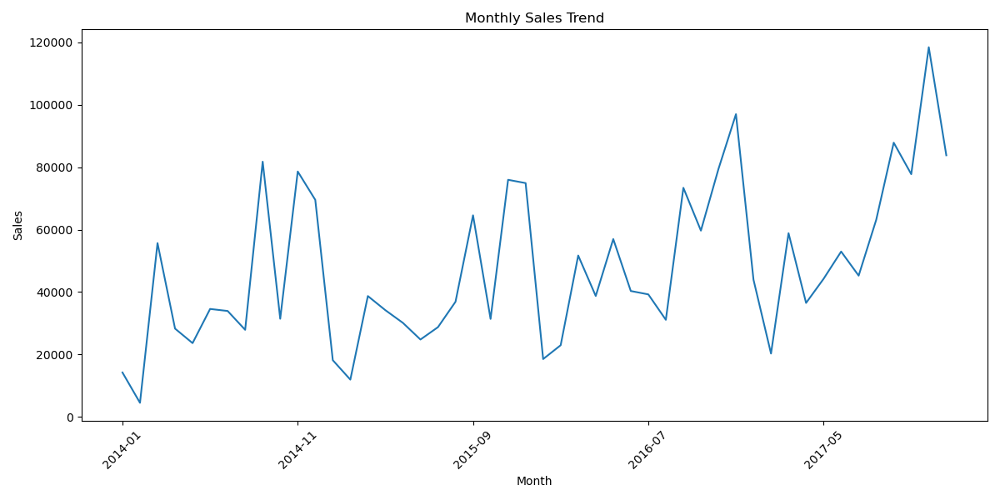
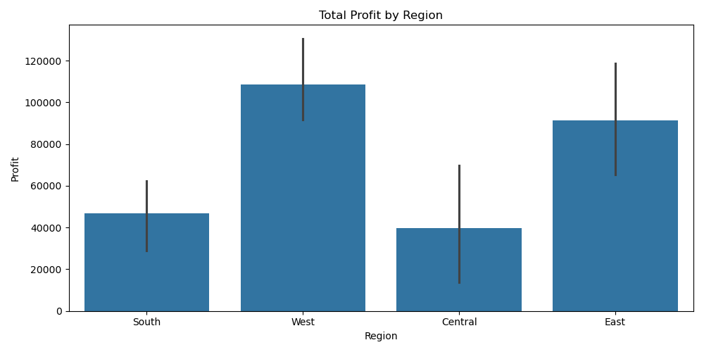
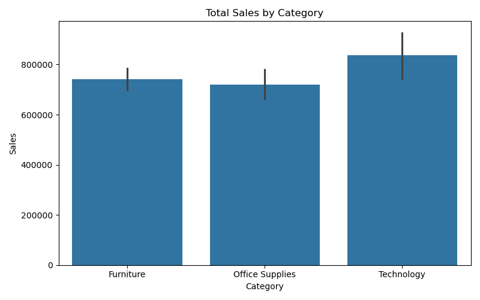
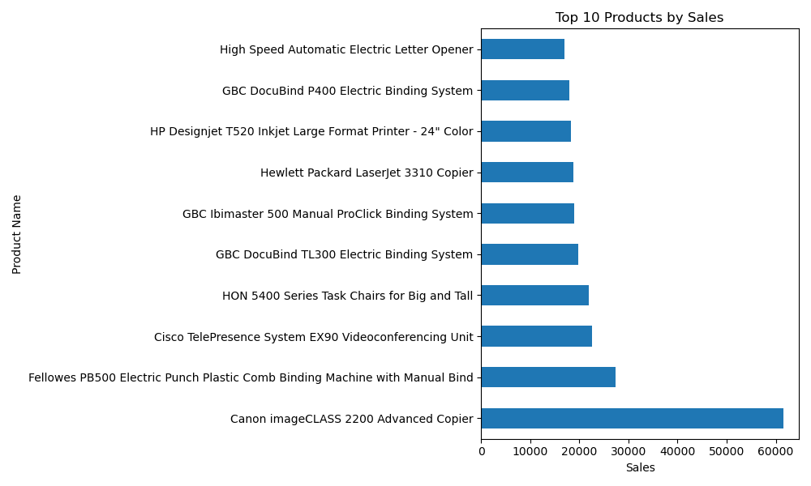
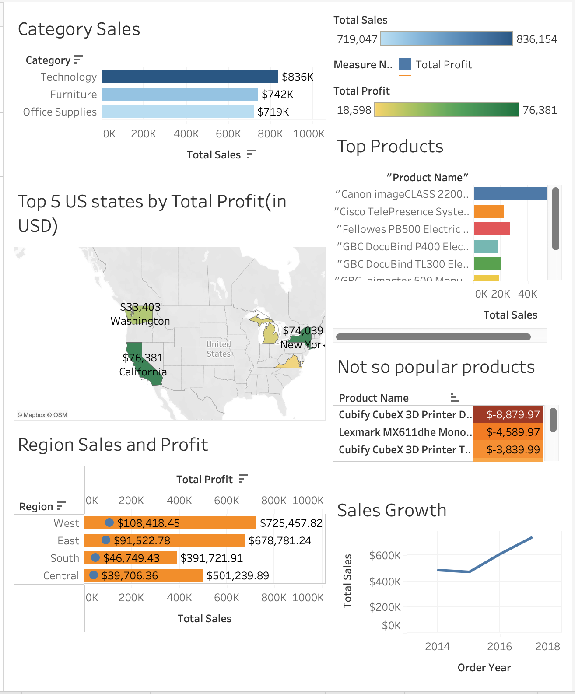

# 📊 Superstore Sales Analysis Project (SQL + Python + Tableau)

## 🚀 Overview

This end-to-end data analysis project explores sales, profit, and customer trends in the *Sample Superstore* dataset. Using **SQL** for data extraction, **Python** for exploratory data analysis (EDA), and **Tableau** for dashboarding, the project provides actionable business insights and visual storytelling.

---

## 🛠️ Tools & Technologies

- **SQL**: Data querying & aggregation
- **Python (Pandas, Matplotlib, Seaborn)**: EDA, cleaning, and visualizations
- **Tableau Public**: Interactive dashboard
- **CSV**: Raw data input
- **MySQL / SQLite**: SQL execution

---

## 📁 Folder Structure

```bash
sql-and-data-analysis-project/
│
├── cleaned_superstore.csv           # Cleaned dataset
├── Sample - Superstore.csv          # Raw dataset
│
├── superstore_analysis.py           # EDA + Insights (Python)
├── eda_visuals.py                   # Plots and visualizations
├── upload_to_sql.py                 # Upload CSV to SQL DB
│
├── sql_queries_insights.sql         # SQL queries for analysis
│
├── eda_outputs/                     # Visuals/images from EDA
├── query_results/                   # SQL query output CSVs
│
└── Tableau Dashboard                # Hosted on Tableau Public
```

---

## 📊 SQL Insights Preview

Examples from `sql_queries_insights.sql`:

```sql
-- Top 10 Products by Total Sales
SELECT `Product Name`, SUM(Sales) AS Total_Sales
FROM superstore_orders
GROUP BY `Product Name`
ORDER BY Total_Sales DESC
LIMIT 10;

-- Top 5 States by Profit
SELECT State, SUM(Profit) AS Total_Profit
FROM superstore_orders
GROUP BY State
ORDER BY Total_Profit DESC
LIMIT 5;
```

---

## 📈 Python EDA Highlights

✔️ Null value checks  
✔️ Profit/Sales distribution plots  
✔️ Top-selling product categories  
✔️ Region-wise sales comparison  
✔️ Exported visuals in `eda_outputs/`

### 📌 Sample EDA Visuals:

**1. Monthly Sales Trend**


**2. Profit by Region**


**3. Sales by Category**


**4. Top Products by Sales**


---

## 📉 Tableau Dashboard

✅ 6-sheet interactive dashboard:  
- **Category Sales**  
- **Top & Bottom Products**  
- **Sales Growth Over Years**  
- **Region & State-Wise Profit**  

📌 Embedded filters for interactivity.

### 📌 Dashboard Preview:



👉 [View Tableau Dashboard](https://public.tableau.com/app/profile/sheshank.priyadarshi3897/viz/SuperstoreSalesAnalysisProject_17545138999050/Dashboard1?publish=yes)

---

## 💡 Key Business Insights

- **Technology** leads all categories in both sales and profit.
- **California** and **New York** are the top-performing states.
- Certain products like *Cubify 3D Printer* consistently report losses.
- Steady **year-over-year growth** in overall sales.

---

## ✅ How to Run This Project

1. Clone the repo
2. Run `upload_to_sql.py` to populate database
3. Use `sql_queries_insights.sql` to extract insights
4. Run `superstore_analysis.py` and `eda_visuals.py` to explore EDA
5. Open Tableau dashboard using `.twbx` file or hosted link

---


## 📬 Let’s Connect!

- 🔗 [LinkedIn](https://www.linkedin.com/in/sheshank3)  
- 💼 [Portfolio](https://github.com/Sheshank212)  
- 📧 Email: sheshankpriyadarshi708@gmail.com
